## Dynatrace RUM: Full End-to-End Model (Top-Level)

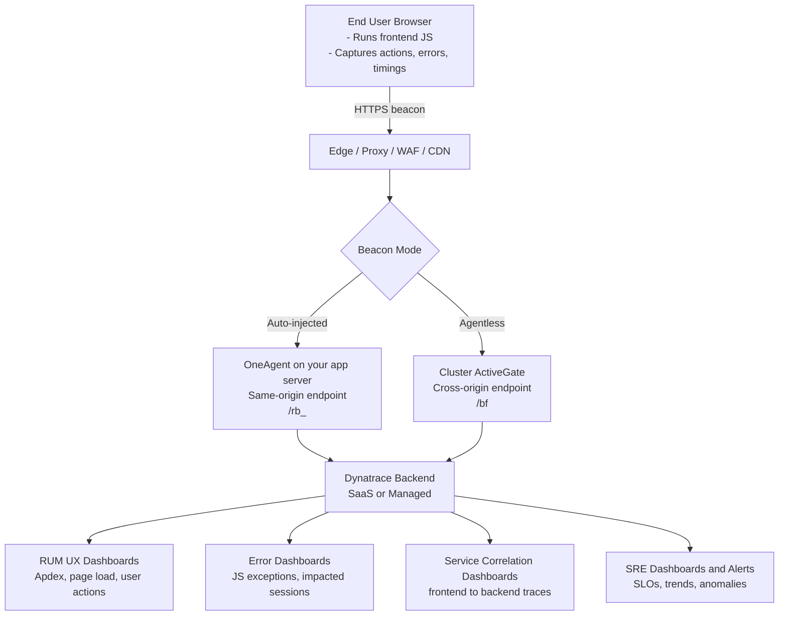

---

## Why frontend monitoring is hard

Frontend code executes in browser, not in your backend process.
Your server usually only serves artifacts, then user experience depends on browser/device/network conditions.

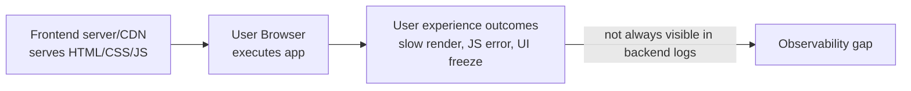

---

## Why only console logs are not enough

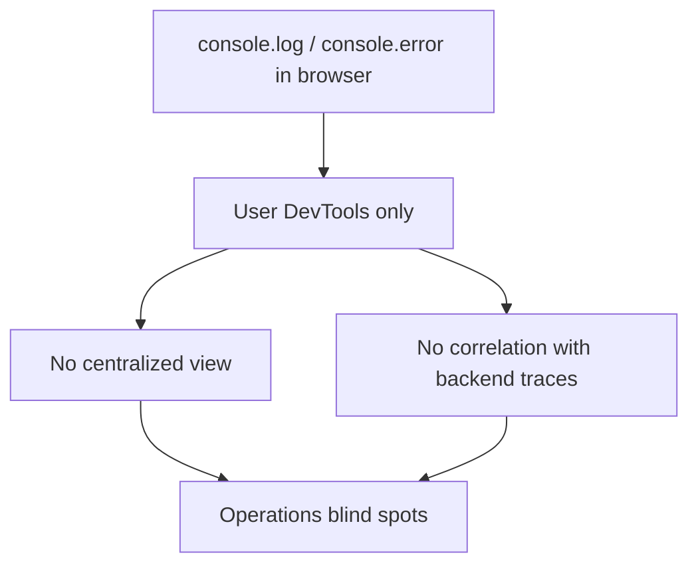

---

## Generic RUM solution flow

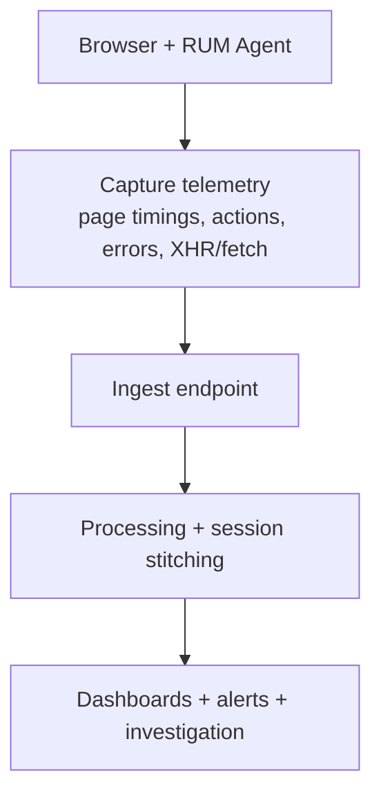

---

## Dynatrace deployment identity A: Auto-injected (OneAgent)

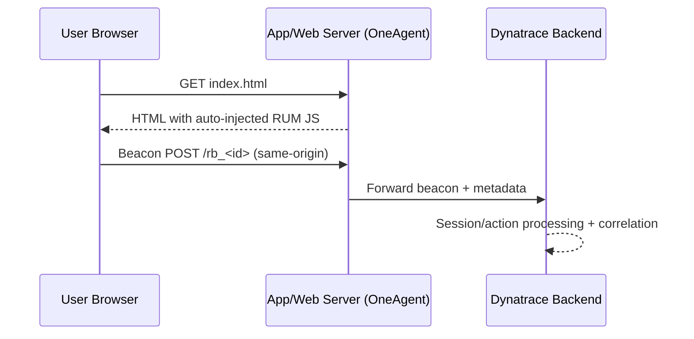

Key points:
- same-origin beacon path
- OneAgent injects script in response
- usually easier for enterprise apps

---

## Dynatrace deployment identity B: Agentless (Cluster ActiveGate)

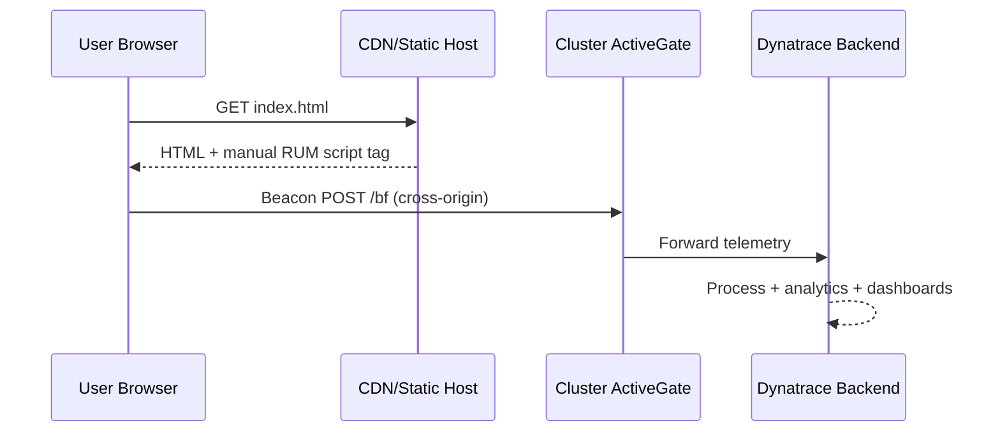

Key points:
- cross-origin beacons
- CORS allowlist required for beacon origin
- common for static frontend hosting

---

## Frontend-backend correlation path (real mechanism)

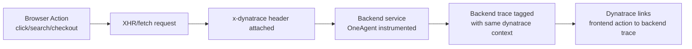

---

## JS error capture flow

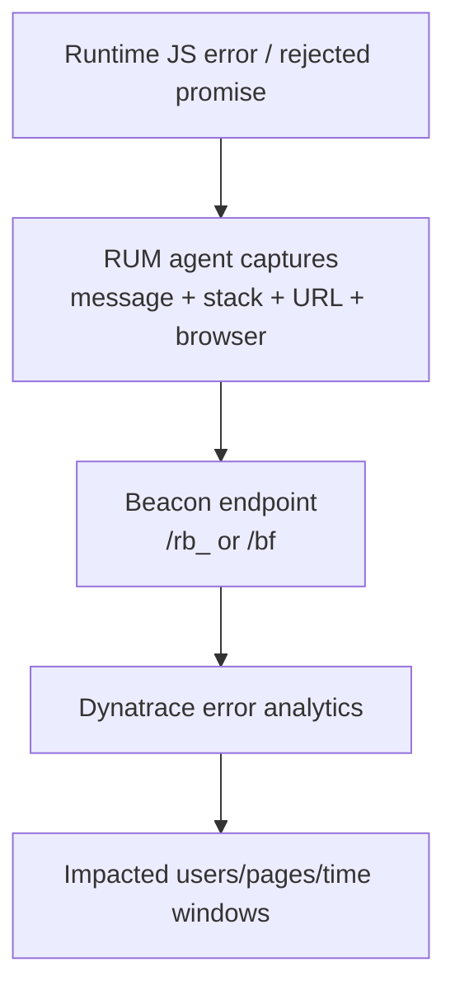

---

## Slow page diagnosis flow

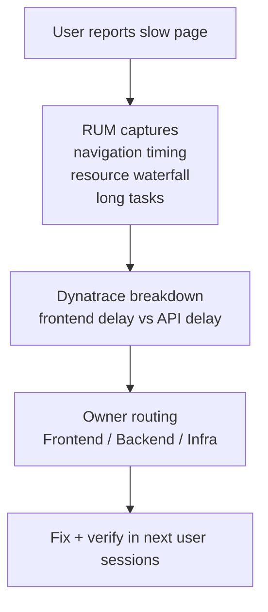

---

## Local/private network architecture view

### SaaS path from enterprise network

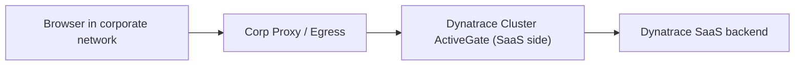

Needs:
- egress allow rules
- CSP + CORS config
- TLS/proxy compatibility

### Managed/private path

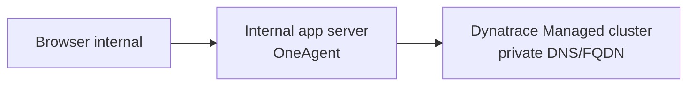

Needs:
- internal DNS and cert trust
- server-to-managed connectivity
- privacy masking policies

---

## Validation flow (what to test in order)

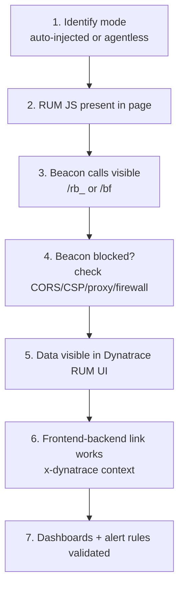

---

## Final takeaway

RUM is the missing observability layer for browser-side truth.
Dynatrace makes it useful by connecting frontend telemetry to backend traces and operational dashboards.

If browser-side telemetry is missing, incident response starts late.
